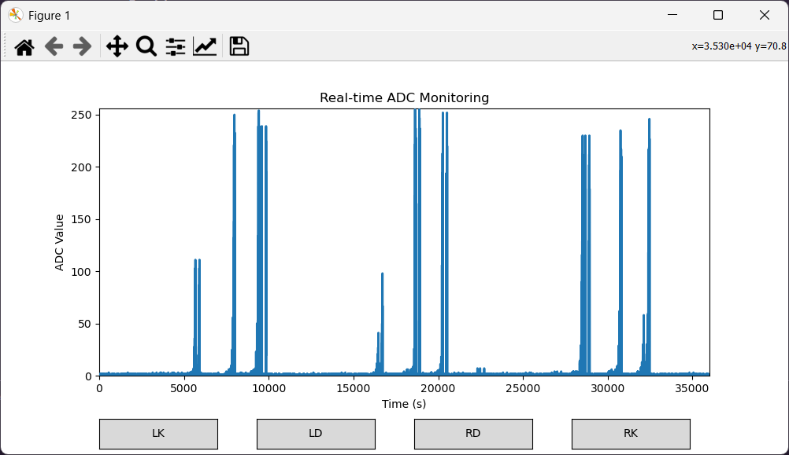

# Taiko Drum Controller

A Taiko Drum Controller made from scratch with emphasis on low latency, responsiveness and customizability.

**This project is still in progress.**

## Demo Video (click)

The following shows an example of the ADC output:

There is also cross-talk between sensors, and the different magnitude of sensor output should also be taken in to account.
For example, the vibration magnitude in Don sensors are usually higher than Ka sensors. This should be balanced.

## Features

- Compatible with both PC and Nintendo Switch
- Fast ADC process loop ensures high input sensitivty and responsiveness

(To be implemented)
- Plays drum sound from the taiko itself for minimal auditory latency
- Web interface for configuring taiko

## TODOs

### Improve double reaction and cross-reaction issues

- **do not reference others. this is a task to practice problem-solving skills**
- export several exerpts of the adc values when drumming to a known ground truth chart
- fix the adc sampler freq so that the timing of the values are known
- then, tune the program externally
- see if sdio can use dma, or just switch to spi entirely (but then need to use other libraries, see which one is quicker)

### Others
- Further stablize ADC with voltage reference and input source filtering and improve wiring
- Implement PS4 and Wii controllers
- Support host OS detection and automatically change device type
- Wireless switch controller / PS4 controller using bluetooth
- Reenable drum sound playing
- Improve input latency
- Create web interface for adjusting sensitivity
- Create emulated USB hub for web interface + usb + com port debugging
- Port all code to C++ and refactor code

## References

HID Taiko: https://zenn.dev/kasashiki/articles/fc73f4cf0733e7
